# Real-Time Smile Detection Web App

## Description

The Real-Time Smile Detection Web App is a cutting-edge application that leverages machine learning and real-time video to count smiles from two individuals independently. Powered by the face-api.js library, the application employs facial expression analysis to determine when a person is smiling and updates the smile counter correspondingly.

## Live Demo

You can try out the application [here](https://seeknndestroy.github.io/smile-detection/). Simply allow webcam access and start smiling!

## Installation

To get the application running locally on your machine, follow these steps:

1. **Clone the repository**: `git clone https://github.com/seeknndestroy/smile-detection.git`
2. **Navigate to the directory**: `cd smile-detection`
3. **Open the `index.html` file**: You can do this in your preferred browser.

Please note that the application requires a webcam to function correctly.

## Usage

The usage of the application is straightforward. After opening the `index.html` file in your browser:

1. Allow the application to access your webcam.
2. You will see your video feed on the screen along with two smile counters (one for each person).
3. Start smiling, and the application will detect your smiles in real-time and increment the corresponding counter.

## Smile Detection Process

Here's a diagram of how the application works:

The smile detection process involves the following steps:

- The process starts with the video feed from the webcam.
- The face detection model identifies the location and size of faces in the video feed.
- The facial expression recognition model identifies the expressions of the detected faces.
- The smile counting algorithm counts the number of times a 'happy' expression (or smile) is detected for each individual.
- The smile counter is updated correspondingly.

## Contributing

Contributions are welcome and greatly appreciated! For detailed instructions on how to contribute, please refer to the `CONTRIBUTING.md` file in the repository.

## License

This project is licensed under the MIT license. For more information, please refer to the `LICENSE` file in the repository.

## Closing Notes

 As an enthusiast of technology and its potential to bring positivity, creating a tool that encourages smiles was an exciting journey. I believe this project is a testament to the potential of combining simple user interfaces with powerful machine learning libraries to create an engaging user experience. Thank you for checking out my project!
